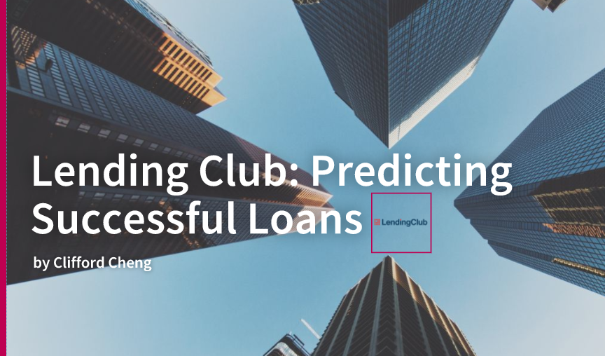
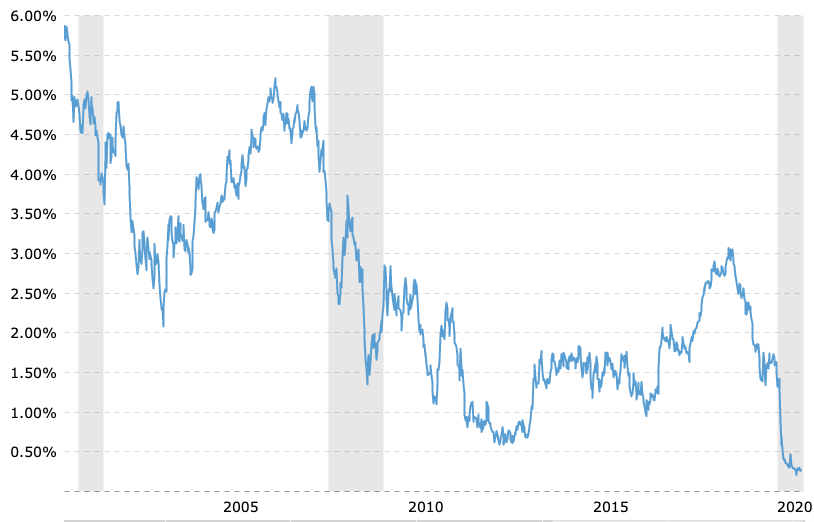
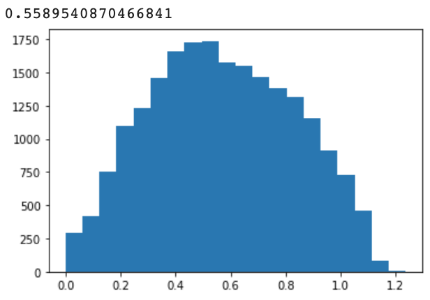
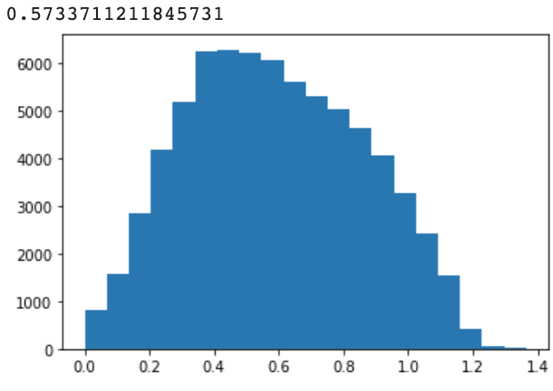
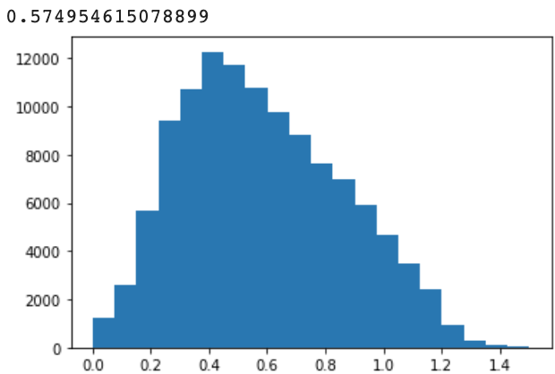
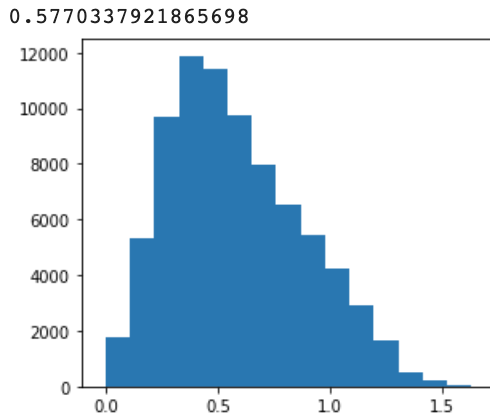
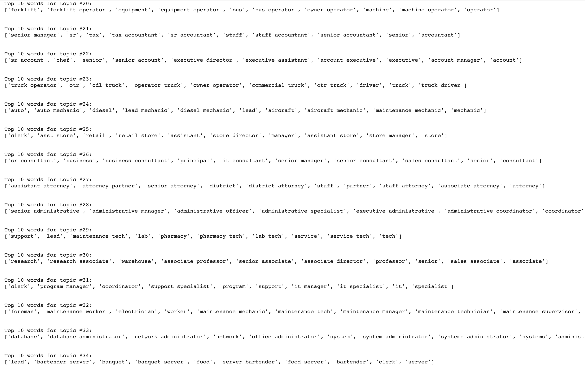

# Lending-Club

> Project Goals:
- Create a loan success and default prediction model. 
- Compare returns of built model with loan grade aggregates. 
---

### Table of Contents
- [Description](#description)
- [Data Understanding](#data-understanding)
- [Model Prediction and Job Title Analysis](#Model-Prediction-and-Job-Title-Analysis)
- [Model Returns and Capital Capacity](#Model-Returns-and-Capital-Capacity)
- [Author-Info](#author-info)

---
## Description

Over the past 20 years interest rates have fallen precipitously with the 5 year US treasury yield currently at 0.29%. With debt obligations projected to reach many multiples of GDP, it is unlikely governments will return to higher interest rates in order to be able to service their massive debts. As a result, individuals and institutional investors alike are desperately seeking alternative safe investment opportunities to generate returns. The appeal of peer-to-peer lending has surged as it allows investors to chase higher yields while mitigating their risk profiles.   

LendingClub is the first and largest SEC registered peer-to-peer lending platform that allows borrowers to create unsecured personal loans for investors to fund. LendingClub operates by approving loan applicants, assigning a risk grade to each loan (A-G), and then packages the loan for funding by outside investors. While safer than the volitile nature of stocks, peer-to-peer loans still carry an inherent level of risk directly related to the security of the future cashflow of the borrower. This project seeks to dive deeper into quantifying the inherent risk of each personal loan in order to build a machine learning model that can predict whether a loan will be successfully paid or not. The success metric of this project can be determined by comparing portfolio returns of simulating purchasing the whole basket of each graded loans to a portfolio of loans generated from the model's prediction. 

[Back To The Top](#Lending-Club)

---

## Data Understanding

The data consisted of 1,816,217 loans (1GB) from LendingClub's website. 39 features were extracted from the data provided for each loan, a few of the features are provided as an example below:

* Issue year: (Numerical) Year loan was issued
* Grade: (Categorical) Lending Club grade assigned to the loan
* Subgrade: (Categorical) Lending Club sub-grade assigned to the loan
* Job Title: (Text) Job title written by user
* Funded amount: (Numerical) Loan amount funded
* Term: (Categorical) Term length of loan, can only take on values of either 36 months or 60 months
* Purpose: (Categorical) Purpose of the loan, includes credit card consolidation, deb
* Application type: (Categorical) Type of application, can take on either Individual or Joint Application
* FICO: (Numerical) FICO score of borrower, created by averaging the low and high range of the borrower's FICO scores
* DTI: (Numerical) Debt to Income Ratio of the borrower based on the monthly debt payments charged to the borrower versus - monthly income
* Annual income: (Numerical) Annual salary of borrower
* Employment length: (Numerical) Years in current role
* Home ownership: (Categorical) Indicates whether a borrower owns a home, is paying off a mortgage, rents or has some other living situation
* Address state: (Categorical) Indicates state the borrower is applying from
* Earliest credit line: (Numerical) The earliest year the borrower had a credit line
* Negative activity: (Numerical) Combination of counts of public record bankruptcies and other credit adverse events
* Inquiries within the last 6 months: (Numerical) Count of times borrower's credit report was inquired upon within the last 6 months
* Delinquencies within the last 6 months: (Numerical) Count of delinquencies within the last 6 months
* Open accounts: (Numerical) Count of open accounts the borrower has
* Total Current Balance: (Numerical) Total outstanding credit of borrower
* Loan Status: (Categorical) Indicates whether loan was Fully Paid or Charged-Off

I was very careful to ensure the features used did not cause bias towards predicting if a loan was successful or not. For example, for loans that defaulted I noticed a metric on most recent credit score would fall drastically. Mostly likely the credit score would fall due to default on the current loan in question. This metric was not used in the model as it contain a lagging indicator that would not be present upon origination of a loan.

[Back To The Top](#Lending-Club)

---

## Data Preparation and NLP Prediction

I utilized Google Colab for the running of the models as I had Colab Pro. However, Amazon SageMaker or creating an AWS Jupyter Notebook EC2 Server with a static IP address were equally robust and viable options.   

The data was split into each separate loan grade category with their corresponding loan success rate and payout rates:

| Grade        | Success Rates           | Interest Rates  |
| ------------- |:-------------:| -----:|
| A | 93.73%    |     7.07%  |
| B | 86.76%    |    10.64%  |
| C | 78.01%    |    14.07%  |
| D | 70.20%    |    17.99%  |
| E | 62.90%    |    21.63%  |
| F | 56.02%    |    25.41%  |
| G | 51.21%    |    28.21%  |

Each loan grade was split into a trade and test set. The training set consisted of loans from 2012-2016 and the test set contained loans from 2017-2018. The training data's defaulted loans were upsampled in order to maintain a balanced dataset and prevent model bias. For example, an A graded loan with only 6.27% of the loans defaulting was upsampled to 50% of the training set. A model would be trained on each loan and then predicted on the test set to obtain the corresponding returns. I tested using single model on all loan grades where the loan grade would be its own classification feature but the model inherently figured out that A and B rated loans had low default rates and therefore marked 99.99% of them as successful to obtain the highest f1 score. 

Three models were tested on each of the loan grades: Logistic Regression, Gradient Boosting Classifier, and XGBoost. Gridsearch was performaced in order to find the optimal parameters but despite having a slightly lower overall f1 score (.70 vs .74), Gradient Boosting Classifer had the highest returns (3.795% vs 2.629% for A rated loans). This is significantly better than the overall return of 2.490% if you purchased all the A rated loans in a portfolio. A dummy model was used to test returns but achieved a very similar return profile as simply purchasing the entirety of graded loans. The returns comparisons for all the rated loans are below:

| Grade        | All Loans          | Model Predicted Loans  |
| ------------- |:-------------:| -----:|
| A |  2.49%    |    3.80%    |
| B |  0.56%    |    3.41%    |
| C | -2.87%    |    0.46%    |
| D | -7.05%    |    -5.12%   |
| E | -8.80%    |    -1.31%   |
| F | -10.1%    |    -3.46%   |
| G | -12.5%    |    -9.53%   |

I wanted to see if there were other ideas in order to improve returns. I originally hypothesized that lower graded loans payouts during defaults would be skewed to the left as borrowers with lower grade may have higher risk of fraud. However, I noticed no matter the loan grade, payout rates folowed a normal distribution. This posited the idea that all borrowers try to follow through with their loans but unforseen consequences causes them to default. This gave me the idea to view the success or failure of a loan through the lens of cashflow security which the biggest influence being job security. This disproved my originally thinking and I began to consider ways to measure job security through data. 

[How much borrowers paid before defaulting A B C D ] 

I used the unsupervised machine learning technique called NMF (non-matrix factorization) to have the algorhythm group the 400,000+ unique Job Title text data into 35 categories. By listing the top 10 words in each group I could see the industry of the future cashflows the loan was ultimately betting on. For example, the previous the model would see a B rated loan with a 740 FICO score originating from California. Using NMF, the model can now consider the same B rated loan with a 740 FICO score but that the borrower was a mid-level attorney from California. Essentially the question of loan success can now be rearranged into a question of how confident the investor believes the mid-level job security of the law industry in California will be during the time period of the loan. In fact, when analyizing the loans from B-C rated borrowers in the law industry I noticed their defaults were significantly lower than their risk-grade's average. One could opine that, in effect, a C rated loan with cashflows dependent on the law industry actually has the risk profile more in line with a B rated loan but still pays out significantly more. 

[Click to View Full Image]

After classifying each loan into each of the 35 categories I ran model again and noticed recall improved significantly depending on loan grade. This directly translates to higher returns:

| Grade        | All Loans          | Model Predicted Loans  |  After NMF |
| ------------- |:-------------:| -----:| -----: |
| A |  2.49%    |    3.80%    | 3.89%  |
| B |  0.56%    |    3.41%    | 3.73%  |
| C | -2.87%    |    0.46%    | 2.20%  |
| D | -7.05%    |    -5.12%   | -0.02% |
| E | -8.80%    |    -1.31%   | -0.09% |
| F | -10.1%    |    -3.46%   | -5.22% |
| G | -12.5%    |    -9.53%   | -8.77% |

The new model returns of A and B rated loans increased by 1% and 10% respectively. While significant I can assume the impact of the NMF model would be lessened as those will more secure paying jobs usually have good credit scores warrenting of A-B rated loans. The largest increase was the C rated loan portfolio where returns were increased from 0.458% to 2.195%, nearly 479%. This can potentially be explained through my previous example that while a C rated borrower has lower FICO scores and credit history, ultimately the biggest influence on him/her paying off a loan is his/her job security which the model can now factor using the NMF classification technique. The only cost of this technique is that the model rejects more loans to invest in but in doing so achieves a much higher return. The details of the returns and capital capacity will be discussed in the next section. 

[Back To The Top](#Lending-Club)

---

## Model Returns and Capital Capacity

In summary, by using NMF and other techniques the returns of each graded loan (besides F rated loans) improved significantly. What is important is that even though the model using the NMF technique rejects more loans to achieve higher returns, the total investment capacity remains relatively high. This implies that the model can be used for large institutions in order to generate significant returns for their investors:

2017-2018

| Grade        | Capital Needed to Purchase All Graded Loans          | Returns  |  
| ------------- |:-------------:| -----:| 
| A |  $1,764,071,650  |    2.49%   | 
| B |  $2,330,580,625  |    0.56%   | 
| C | $2,484,159,825   |    -2.87%  | 
| D | $1,217,246,250   |    -7.05%  | 
| E | $432,706,400     |    -8.80%  | 
| F | $132,478,175     |    -10.10% | 
| G | $68,824,575      |    -12.53% | 

Predicted Model (no NMF)
| Grade        | Capital Needed to Purchase Model Predicted Loans          | Returns  |  
| ------------- |:-------------:| -----:| 
| A |  $1,105,211,625  |    3.80%  | 
| B |  $1,239,048,925  |    3.41%  | 
| C | $1,445,211,900   |    0.46%  | 
| D | $1,061,928,725   |    -5.12% | 
| E | $171,858,700     |    -1.31% | 
| F | $42,568,250      |    -3.45% | 
| G | $28,617,750      |    -9.53% | 

Predicted Model (w/ NMF)
| Grade        | Capital Needed to Purchase Model Predicted Loans (w/ NMF)         | Returns  |  
| ------------- |:-------------:| -----:| 
| A |  $1,113,533,675  |    3.89%  | 
| B |  $1,231,850,700  |    3.73%  | 
| C | $1,155,818,650   |    2.20%  | 
| D | $495,491,575     |    -0.02% | 
| E | $170,440,275     |    -0.09% | 
| F | $43,682,700      |    -5.22% | 
| G | $29,993,450      |    -8.77% | 

As mentioned, the biggest impact was C rated loans. The new model rejected over $300,000,000 worth of C rated loans but was able to improve its returns profile from 0.46% to 2.20%. In addition, while the new model rejected over $500,000,000 of D rate loans and improved performance from -5.12% to -0.02%, it is still barely breakeven so would not be incorporated into any pension fund or other instutitional portfolio. The next steps to improve this model would be to perform improved text classfication techniques using Glove or Google's Word2Vec utilizing the Bureau of Labor Statistics job title classification of over 6,850 jobs into 100 categories. I had this data ready but due to time constraints, decided not to implement it into the model. Another aspect to note was that only loans that were classified as Fully Paid (successful) and Charged Off (defaulted) were considered. Since loans come in 36 month and 60 month terms, the closer the loan date approaches 2018 the more loans classified as Current (still being paid) increases. Because of this, the returns of the current model are actually less than they should be since as time passes, those who should default should already have defaulted while loans still being paid are not considered in the model.

Despite this, the returns achieved through the machine learning model are impressive and I hope to continue to build similar projects that can be applied to solve other business problems and obtain additional insights to generate excess returns.

---

## Author Info

- LinkedIn - [clifford-cheng](https://www.linkedin.com/in/clifford-cheng/)
- Email - cliffpcheng@gmail.com

